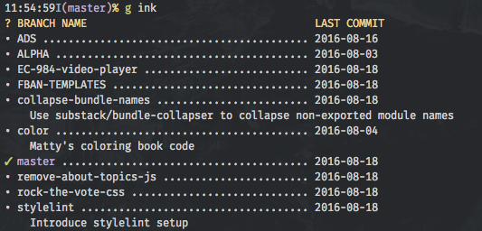

# git-ink

Pull out the `[branch]` description from your `.git/config`; quickly edit and
view your branches, with annotations; hashtag branches for easier management.



## Support

- OSX - Partial
    - the `git ink` command works but options do not (pending a getopts rewrite)
        - Use `git branch --edit-description` to add descriptions in the interim

- Linux - Full
    - `git ink` and all its flags work.

## Install

Put `git-ink` somewhere in your path.

## Usage

```shell
git branch --edit-description     # opens $EDITOR to edit a description
git ink                           # pretty list of branches and descriptions
git ink -h                        # help
git ink -b dev -g                 # display description of "dev" branch
git ink -b dev -s "prepend me to existing description"
git ink -b dev -r "overwrite entire description with this"
```

A `.gitbranch` file will be used as the canonical source of meta data for this
plugin if one is provided. It is in the same format as gitconfig files.
It MUST be added to `.gitignore` so it can exist in all branches (otherwise
you would not have all the meta for all branches)

## TODO

- sync with the branch info and descriptions stored in `.git/config`.
- find a good way to keep the .gitbranch file distributed across multiple repo,
  but available to all branches
- rewrite in Ruby or Python for better compatibility
- tests

## Changelog

- 2015-10-26
    - Release v1.0.1
    - add header, _output_line function

- 2015-10-22
    - Release v1.0.0
    - Fix arg parsing, var scoping, every function accepts branch name now
    - Updated screenshot

- 2015-10-19
    - Change output formatting, indent branch descriptions

